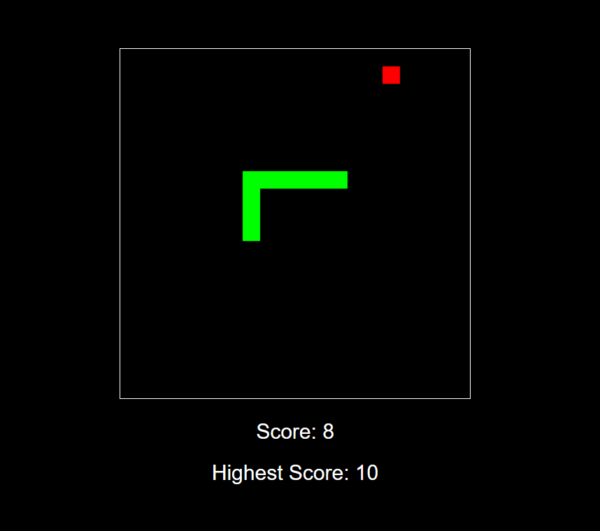

# Snake Game 🐍
A classic Snake game implemented using HTML, CSS, and JavaScript. Play the game in your browser and try to beat your high score!

**About the Game:**
This is a simple implementation of the classic Snake game. The goal is to control the snake using arrow keys, eat the food to grow longer, and avoid colliding with the walls or yourself. The game keeps track of your score, which increases as you eat more food.

**How to Play:**
1. Use the Arrow Keys to control the snake:
    - Up Arrow: Move up
    - Down Arrow: Move down
    - Left Arrow: Move left
    - Right Arrow: Move right
2. Eat the red food to grow longer and increase your score.
3. Avoid colliding with the walls or your own tail.
4. The game resets if you collide, and your score will be set to 0.

**Features:**
- Simple and intuitive controls.
- Score tracking.
- Responsive design that works on desktop and mobile browsers.
- Randomly generated food placement.

**How It Works:**
The game is built using:
- HTML: Structure of the game.
- CSS: Styling for the game board and score display.
- JavaScript: Game logic, including snake movement, collision detection, and food generation.

**Key Components:**
- Snake: Represented as an array of segments, each with x and y coordinates.
- Food: Randomly placed on the grid.
- Game Loop: Continuously updates the game state and redraws the canvas.
- Collision Detection: Checks if the snake collides with the walls or itself.
- Score Tracking: Increases as the snake eats food.
